# 任务划分
#### 需求分析

1. 登录界面：  
负责人：  
功能实现图片  
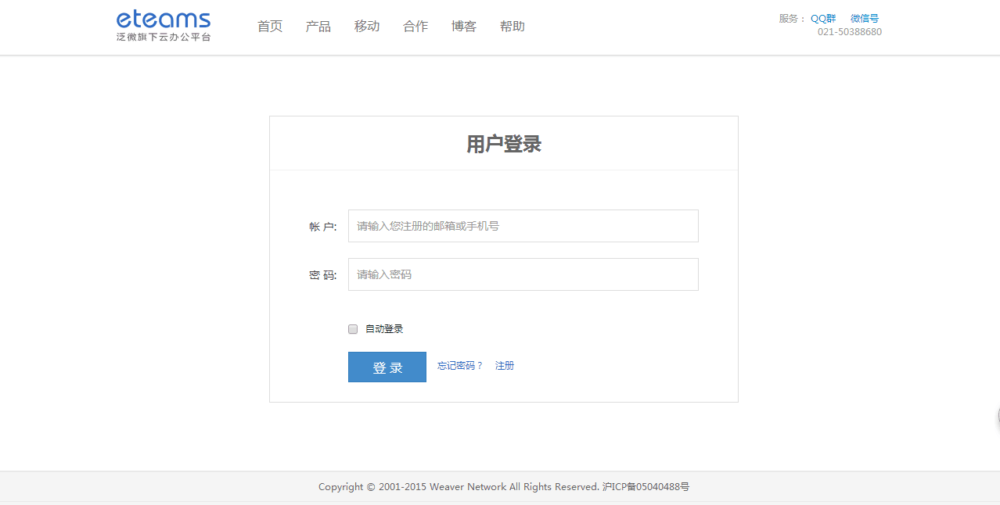
2. 内部页面，导航分支  
负责人：  
任务：实现顶部和右侧边的导航样式，利用position：fixed定位，注意中间留白用于

加载iframe。注意点击创建和用户名，有菜单弹出。
功能实现图片  


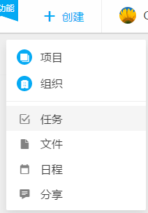
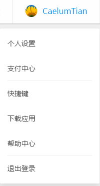
  
3. 个人项目页制作：  
负责人：  
任务：实现个人项目的展示，注意图片数遍放上会扶起，同时出现项目编辑按钮。同时完成，弹出层的项目设置界面。  

功能实现图片  
   

弹出样式设计，这里只需要有项目信息就可以，其他的省略 
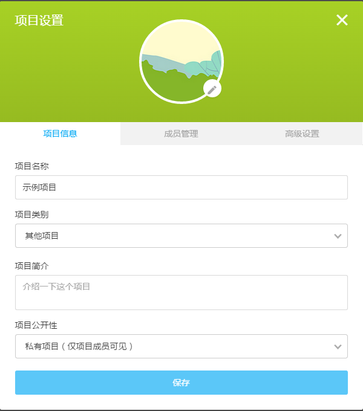  
4. 项目内页-主页设计    
负责人：  
任务： 完成个人任务列表，任务统计，表格统计（暂缓）。导航先实现 添加新任务。任务列表前边加上删除按钮，点击，该条任务消失，表示完成。  
功能实现图片：  
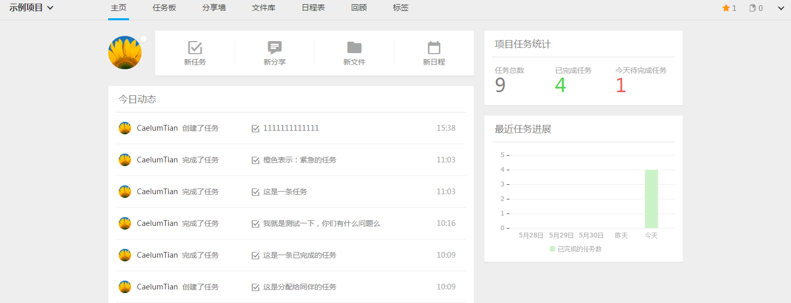
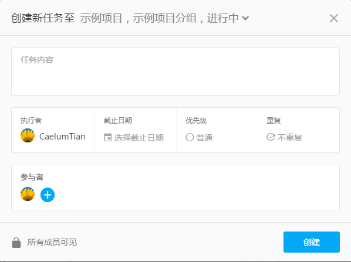
   
5. 任务版设计：  
负责人：  
任务：实现任务版设计，按照如下划分栏目：进行中任务，已过期任务，已完成任务。
注意优先级颜色：红色，黄色，无颜色。
功能实现图片：  
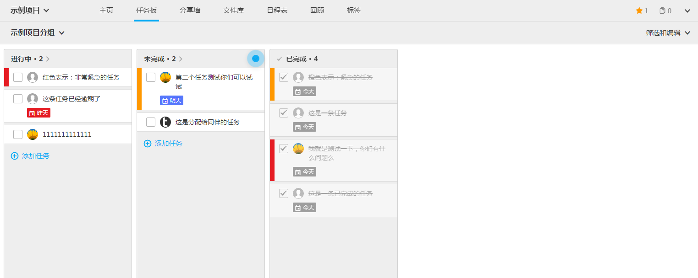
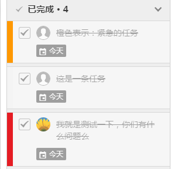  
6. 回顾设计:  
负责人：  
任务：实现回顾任务时间轴，注意要js调出数据添加时间轴，写静态页面注意可扩展性  
功能实现图片： 
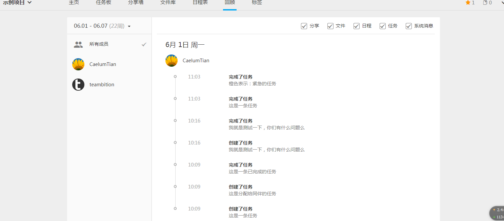  
7. 弹出层框架设计：  
负责人：  
任务: 实现弹出层插件
```  
  <div id="alert">
  	...
  </div>
  <button id="pop">
  <button id="push">
  <script>
  		$("#pop").onclick = open;    //为button绑定你的事件，点击弹出弹出层
  		$("#push").onclick = close;  //同样，点击关闭弹出层，回到原来
  </script>  
```      

8. 数据接口设计：  
负责人：  

任务：  

1.简历个人信息表。2.个人项目表，id表示项目，tid表示该项目下的任务。3.日程表
提供接口插入信息，读取信息，接口参数再定。  
  
##附加任务  
1. 移动端设计：  
负责人：  
任务：  
完成该网站的移动端设计，可以考虑移动端网页或者Hybrid app，样式也可以参考该网页移动版   
功能实现图片：


2. 日历完善：  
负责人：  
任务：  
实现日历部分，添加时间，地点。   
功能实现图片：  

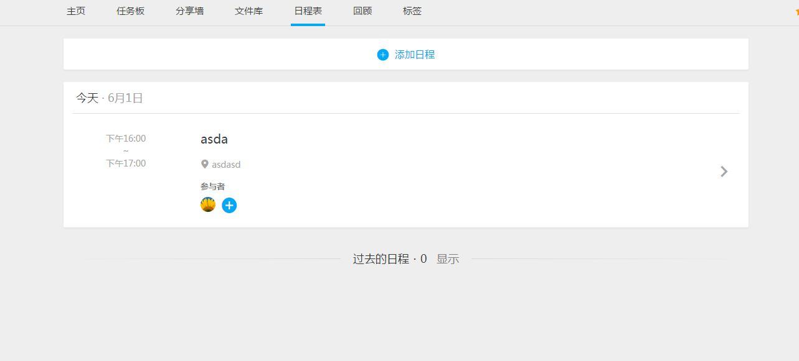  
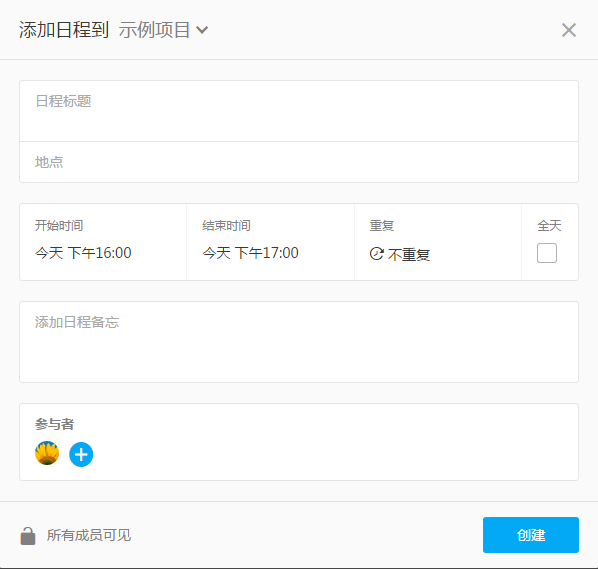 


