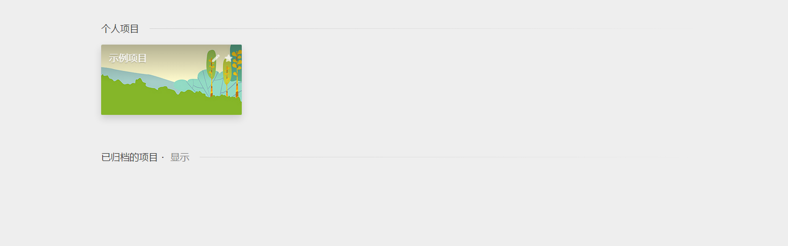
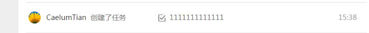

# 任务划分
#### 需求分析

1. 登录界面：  
负责人：  
功能实现图片  

2. 内部页面，导航分支  
负责人：  
任务：实现顶部和右侧边的导航样式，利用position：fixed定位，注意中间留白用于

加载iframe。注意点击创建和用户名，有菜单弹出。
功能实现图片  

  
3. 个人项目页制作：  
负责人：  
任务：实现个人项目的展示，注意图片数遍放上会扶起，同时出现项目编辑按钮。同时完成，弹出层的项目设置界面。  

功能实现图片  
   

弹出样式设计，这里只需要有项目信息就可以，其他的省略 
  
4. 项目内页-主页设计    
负责人：  
任务： 完成个人任务列表，任务统计，表格统计（暂缓）。导航先实现 添加新任务。任务列表前边加上删除按钮，点击，该条任务消失，表示完成。  
功能实现图片：  

 